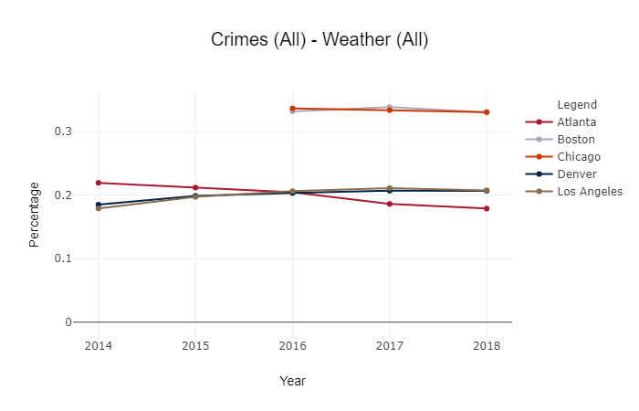

# Crime-Weather Analysis

## Question

Does weather affect crime?

## Data

Selected crime and weather data from 2014 - 2018 for the following cities: Atlanta, Boston, Chicago, Denver, and Loss Angeles. The data fields include city, crime code, crime description, start time (hour 0-23), latitude, longitude, weather type. The data crime and weather data were merged into one file (not committed due to size) including crime and weather mappings. The population for each metro area was added to the summarized file (Data Anlaysis/db/crime_pop.sqlite). Jupyter Notebook was used to combine and summarize the data. 

## Dashboard

The population for each metro area was added to the summarized file. The file was coverted to a sqlite format to use with SQLAlchemy and deployed an interactive dashboard plotting the crime data.

